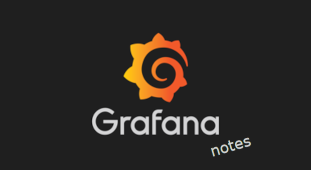

# My Grafana Learning Notes

### [Grafana Fundamentals](https://learn.grafana.com/path/grafana-fundamentals)

GROT Academy is a newer enablement resource aimed at de-mystifying Observability. The course is geared toward both technical and non-technical folks, but my takeaway so far is, in order to get actionable value from Grafana, I first need to level up on Kubernetes. 

Kubernetes defines the metrics, labels, and lifecycles we’re trying to visualize. With that context in hand, dashboards can become actionable insights. Luckily, there was a sale on [Thrive Annual](https://training.linuxfoundation.org/subscriptions/) so I picked up a subscription to help me get there! I'll circle back to Grafana once I am more solid in my k8s skills and hopefully by then GROT will have more content by then!

---

### [CKAD Learning Notes](k8s/CKAD.md) 

There's nothing like completing a full course in Kubernetes to learn how much I still needed to learn! I just completed [Certified Kubernetes Application Developer](https://www.credly.com/badges/2c5458e2-0c2f-4458-9ec2-401355ee6539), the first cert in my goal to Kubstronaut. While I'm sure I can get what I need without KCNA and KCSA, work will pay for it and I do want that jacket! I work with them pretty often during sev1s and I'd like to be able to contribute more when I'm sitting at the table. 

---

### [CKA Learning Notes](k8s/CKA.md) 

Since this one digs into the architecture, it was time to set up [Linux VMs](k8s/CKAlab.md). 

My computer wasn't hefty enough to maintain the VMs so I practiced using the remote dekstop by [sailor-sh on GitHub](k8s/CKAplab.md). 

As for the labs itself, I'm starting off with [IT Kiddie](k8s/). 